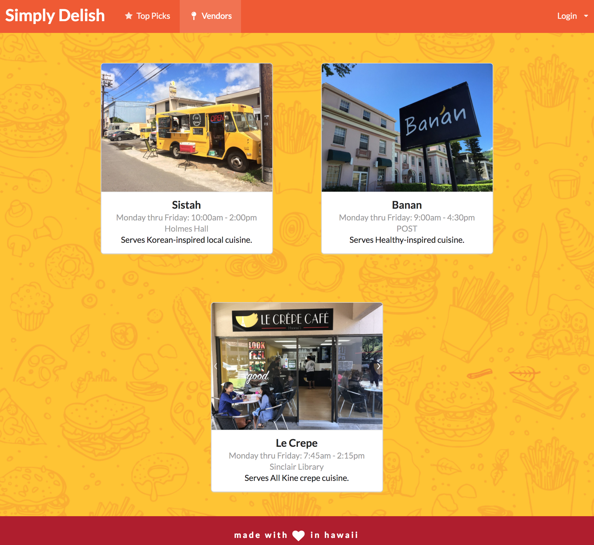
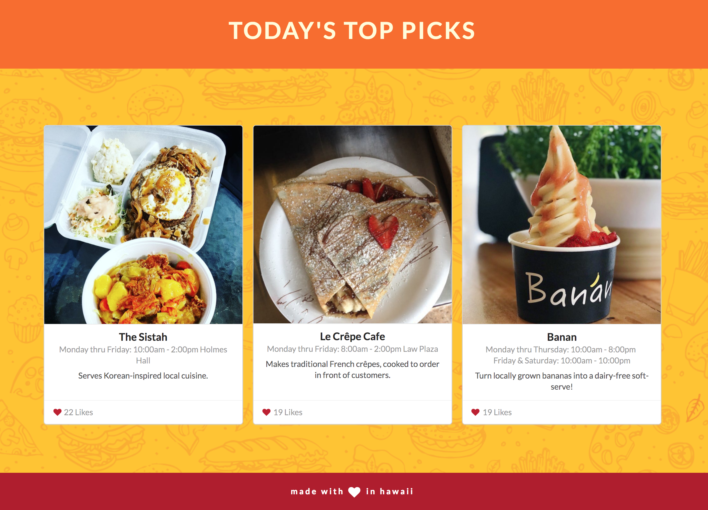

# Table of contents

* [About Simply Delish](#about-simply-delish)
* [Latest Version](#latest-version)
* [Development History](#development-history)
* [Meet the Team](#meet-the-team)

# About Simply Delish 
 

Simply Delish is an application that resolves the problem of there being many food choices on campus. This app allows you to know what specific menu items will be available today at campus center locations, and as well as tell what food is available at the moment. It can also tailor to the style of food you love and let you know when it is available.

Our goal at Simply Delish is to create a tool for Manoa students that will ease thier journey into finding their next delicious meal on campus.

# Latest Version

## Landing  Page

## Vendors 

## User Home Page

# Development History

Progress on the Simply Delish is divided into four milestones. Each milestone is a progression in the development process.

## Milestone 1: Create Visual Mockups for Pages

The goal of this milestone was to determine the general direction of the project as well as determine what pages are needed and how they will all interact with each other at an abstract level.

### Mockup Screenshots

#### Landing Page

#### User Home Page

#### User Profile

#### Add Vendor

## Milestone 2: Functionality

The last milestone was focused mainly on the aesthetics of the application. Milestone 2 focused on adding some functionality. Our focus was on converting the rest of our pages from HTML mockups to React, implementing a dynamic navigation bar, and creating and integrating backend MongoDB collections.

### Milestone 2 Screenshots

#### Landing Page

#### Top Picks

#### Add Vendor

#### User Profile

#### Vendors

#### Vendor Homepage

# Links

Application: [Application](http://simplydelish.meteorapp.com/#/)  
Project Board M1: [Project Board M1](https://github.com/simplydelish/simplydelish/projects/1)  
Project Board M2: [Project Board M2](https://github.com/simplydelish/simplydelish/projects/2)

# Meet the Team
**Josefina Fortin**

Skills / Background: *HTML & CSS, Java, Web Design* 
Interests: *Video Games, Web Design, Photography* 
Portfolio: *https://josefinafortin.github.io/*

**Vialli Ou**

Skills / Background: *Java, SQL, Javascript* 
Interests: *Software Engineering, Web Development, Mobile App Development* 
Portfolio: *https://vialliou.github.io/*

**Karissa Huynh**

Skills / Background: *C, Javascript, Java* 
Interests: *Software Development, Web Development, Mobile App Development* 
Portfolio: *https://khuynh24.github.io/*

**Jayson Nutt**

Skills / Background: *Information Security / Cybersecurity, Python, C/C++/C#, Java, Javascript, Visual Basic, .NET, Angular.js, Drupal, Twitter Bootstrap, HTML / CSS, PHP, Node.js, Ionic Framework* 
Interests: *System Security, Cryptography, Data Visualization* 
Portfolio: *https://jaysonnutt.github.io/*

