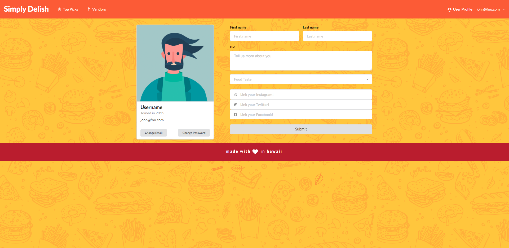

# Table of contents

* [About Simply Delish](#about-simply-delish)
* [Latest Version](#latest-version)
* [Developer Guide](#developer-guide)
* [Development History](#development-history)
* [Meet the Team](#meet-the-team)

# About Simply Delish 
 


Simply Delish is an application that resolves the problem of there being many food choices on campus. This app allows you to know what specific menu items will be available today at campus center locations, and as well as tell what food is available at the moment. It can also tailor to the style of food you love and let you know when it is available.

Our goal at Simply Delish is to create a tool for Manoa students that will ease thier journey into finding their next delicious meal on campus.

# Latest Version

## Landing  Page


## User Home Page


## User Profile


## Vendors 


## Add Vendor


## Top Picks


## Login, Register, & Sign Out


# User Guide

#### Landing Page
After deploying the Simply Delish application, users are welcomed with an abstract photo slider that greets the users with various photos of irresistible meals. The landing page also informs users what Simply Delish is all about, what we have to offer, and the goal of our company.


#### User Profile
Users can personalize their profile by providing information about themselves and are able to update their food preferences.


#### Top Picks
Search the most popular meals of the day.  With a click of a button, you can see the most favorable food items sorted by the votes of fellow users.


#### Vendors
Simply Delish also allows users to scroll and search through all the vendors available on campus. This allows individuals to get a sneak peak, while exploring each vendor by reading a short description of each establishment. Users may also easily view the vendor's hours of opertaion.


#### Add Vendor
Vendors are able to sign up and add more information about their establishment to help users know where they are and when they can have access to their delicious food.


#### Vendor Homepage
Establishments is also able to add and post up their food items of the day. There is also a menu of all the food items they created and is able to edit and delete them if they wanted to.


# Developer Guide

This section will walk you through the steps to get the project running locally.

## Installation

[Install Meteor](https://www.meteor.com/install)

Clone this GitHub repo to your local computer. *You may need to request access.*
```bash
$ git clone https://github.com/simplydelish/simplydelish
```

cd into the `app/` directory
```bash
$ cd simplydelish/app/
```

Install package dependencies
```bash
$ meteor npm install
```

Start the application
```bash
$ meteor npm run start
```

If all goes well, your command line output should look like this.

```bash
$ meteor npm run start

> meteor-application-template-react@ start /Users/Jayson/git/github/simplydelish/app
> meteor --no-release-check --settings ../config/settings.development.json

[[[[[ ~/git/github/simplydelish/app ]]]]]

=> Started proxy.
=> Started MongoDB.
I20180425-00:19:45.350(-10)? Creating the default user(s)
I20180425-00:19:45.531(-10)?   Creating user vendor@foo.com.
I20180425-00:19:45.532(-10)?   Creating user admin@foo.com.
I20180425-00:19:45.532(-10)?   Creating user john@foo.com.
I20180425-00:19:45.532(-10)? Creating default data.
I20180425-00:19:45.532(-10)?   Adding: Basket (john@foo.com)
I20180425-00:19:45.532(-10)?   Adding: Bicycle (john@foo.com)
I20180425-00:19:45.532(-10)?   Adding: Banana (admin@foo.com)
I20180425-00:19:45.533(-10)?   Adding: Boogie Board (admin@foo.com)
I20180425-00:19:45.533(-10)? Creating default vendors.
I20180425-00:19:45.533(-10)?   Adding: Sistah to vendors collection
I20180425-00:19:45.699(-10)?   Adding: Banan to vendors collection
I20180425-00:19:45.699(-10)?   Adding: Le Crepe to vendors collection
I20180425-00:19:45.700(-10)? Creating default foods.
I20180425-00:19:45.700(-10)?   Adding: Super-Loco Loco-Moco to foods collection
I20180425-00:19:45.700(-10)?   Adding: Banana Swirl to foods collection
I20180425-00:19:45.700(-10)?   Adding: Strawberry & Chocolate Drizzle to foods collection
=> Started your app.

=> App running at: http://localhost:3000/
```

**Warning Message:** You may get a warning like this.

```bash
W20180425-00:19:45.533(-10)? (STDERR) Note: you are using a pure-JavaScript implementation of bcrypt.
W20180425-00:19:45.534(-10)? (STDERR) While this implementation will work correctly, it is known to be
W20180425-00:19:45.534(-10)? (STDERR) approximately three times slower than the native implementation.
W20180425-00:19:45.534(-10)? (STDERR) In order to use the native implementation instead, run
W20180425-00:19:45.534(-10)? (STDERR)
W20180425-00:19:45.534(-10)? (STDERR)   meteor npm install --save bcrypt
W20180425-00:19:45.535(-10)? (STDERR)
W20180425-00:19:45.535(-10)? (STDERR) in the root directory of your application.
```

*Bcrypt* is not used in this application in order to maintain cross-platform compatibility. It is non-trivial to install *Bcrypt* on Windows and the impact of omitting it on small applications such as this is negligable. The warning can be safely ignored.

Once running, you can view the application at [http://localhost:3000.](http://localhost:3000)

# Development History

Progress on the Simply Delish is divided into four milestones. Each milestone is a progression in the development process.

## Milestone 1: Create Visual Mockups for Pages

The goal of this milestone was to determine the general direction of the project as well as determine what pages are needed and how they will all interact with each other at an abstract level.

### Mockup Screenshots

#### Landing Page


#### User Home Page


#### User Profile


#### Add Vendor


## Milestone 2: Functionality

The last milestone was focused mainly on the aesthetics of the application. Milestone 2 focused on adding some functionality. Our focus was on converting the rest of our pages from HTML mockups to React, implementing a dynamic navigation bar, and creating and integrating backend MongoDB collections.

### Milestone 2 Screenshots

#### Landing Page


#### Top Picks


#### Add Vendor


#### User Profile


#### Vendors


#### Vendor Homepage


### Milestone 3 Screenshots

#### Landing Page


#### Top Picks


#### Add Vendor


#### User Profile


#### Vendors


#### Vendor Homepage


# Links

Application: [Application](http://simplydelish.meteorapp.com/#/) <br>
View Project on GitHub: [View Project on GitHub](https://github.com/simplydelish/simplydelish) <br>
Project Board M1: [Project Board M1](https://github.com/simplydelish/simplydelish/projects/1) <br>
Project Board M2: [Project Board M2](https://github.com/simplydelish/simplydelish/projects/2) <br>
Project Board M3: [Project Board M3](https://github.com/simplydelish/simplydelish/projects/3)

# Meet the Team
**Josefina Fortin**

Skills / Background: *HTML & CSS, Java, Web Design*<br>
Interests: *Video Games, Web Design, Photography*<br>
Portfolio: *https://josefinafortin.github.io/*

**Vialli Ou**

Skills / Background: *Java, SQL, Javascript*<br>
Interests: *Software Engineering, Web Development, Mobile App Development*<br>
Portfolio: *https://vialliou.github.io/*

**Karissa Huynh**

Skills / Background: *C, Javascript, Java*<br>
Interests: *Software Development, Web Development, Mobile App Development*<br>
Portfolio: *https://khuynh24.github.io/*

**Jayson Nutt**

Skills / Background: *Information Security / Cybersecurity, Python, C/C++/C#, Java, Javascript, Visual Basic, .NET, Angular.js, Drupal, Twitter Bootstrap, HTML / CSS, PHP, Node.js, Ionic Framework*<br>
Interests: *System Security, Cryptography, Data Visualization*<br>
Portfolio: *https://jaysonnutt.github.io/*

